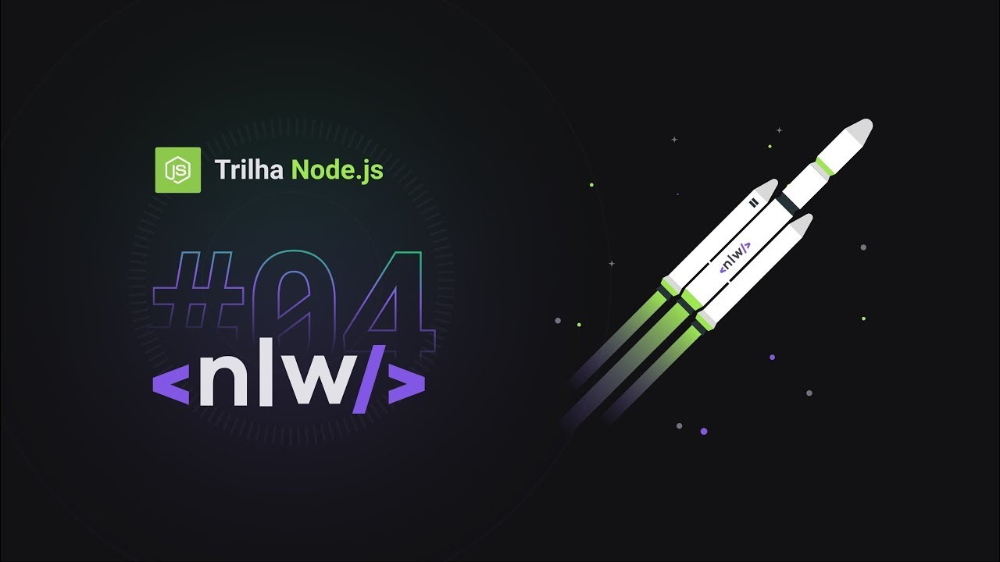

<center><h1 >NodeJS 👨🏻‍💻</h1></center>



<br/>
<br />

<p align="center">
  <a href="#-sobre"> Sobre </a>&nbsp;&nbsp;&nbsp;|&nbsp;&nbsp;&nbsp;
  <a href="#-material-de-apoio">Material de apoio</a>&nbsp;&nbsp;&nbsp;|&nbsp;&nbsp;&nbsp;
    <a href="#-algumas-das-tecnologias-utilizadas">Tecnologias</a>&nbsp;&nbsp;&nbsp;|&nbsp;&nbsp;&nbsp;
    <a href="#-projeto">Projeto</a>&nbsp;&nbsp;&nbsp;|&nbsp;&nbsp;&nbsp;
    <a href="#-como-baixar">Como baixar</a>


## 🔖 Sobre

<p align="justify">
Esse projeto foi desenvolvido durante a trilha de NodeJS, na quarta edição da NLW.
Aprendemos conceitos sobre o que é um API, como iniciar um projeto utilizando Typescript e Express para gerenciamento das rotas, TypeORM para manipulação dos dados, testes automatizados e envio de e-mail.

</p>

---

## 📌 Algumas das tecnologias utilizadas</h1>

<p align="justify">
Abaixo estão algumas das tecnologias utilizadas durante o desenvolvimento da API. Ainda foi visado: Organizar o diretório da nossa aplicação de forma concisa, limpa e eficiente. Escrever código limpo visando reutilização e eficiência e criar testes unitários e de integração.
</p>
<br>
<p align="center">
  
  
  
  
  
  
</p>

---

## 💻 Projeto

<p align="justify">
    O NPS é uma aplicação que consiste em calcular o NPS da empresa. Nele fazemos o cadastro de usuários, cadastro de pesquisas, envio de e-mail para os usuários responderem as pesquisas de satisfação e com isso podemos realizar o cálculo do NPS.
</p>

---

## 🗂 Material de apoio

- [Typescript](https://www.typescriptlang.org/)
- [Ethereal-Email](https://ethereal.email/)
- [TyeORM](https://typeorm.io/#/)
- [Express](https://expressjs.com/pt-br/)
- [Jest](https://jestjs.io/)
- [SQL Editor Beekeeper Studio](https://www.beekeeperstudio.io/)

---

## ⬇️ Como baixar

```bash
    // Clonar repositório
    $ git clone https://github.com/douglasconstancio/nodejs.git

    // Acessar diretório
    $ cd nodejs

    // Instalar dependências
    $ yarn

    // Iniciar projeto
    $ yarn dev
```
---
